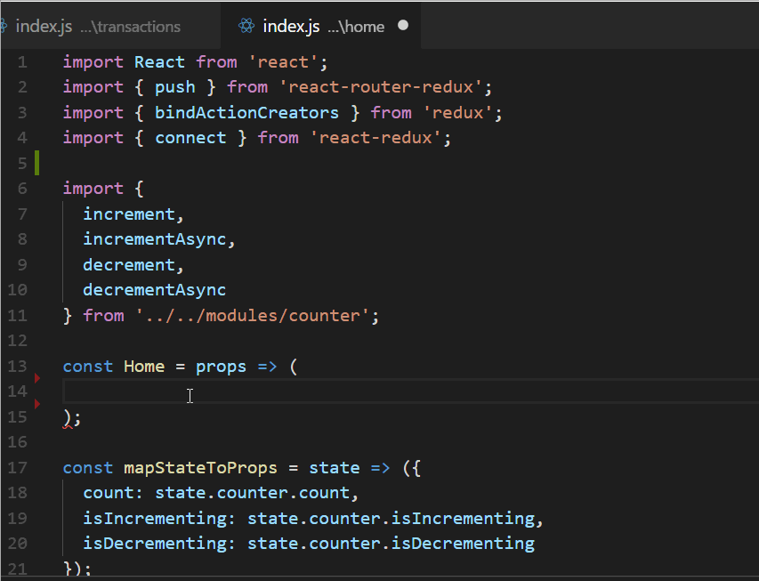

# reactstrap-snippets

This is an extension for Visual Studio Code that adds snippets for ReactStrap (React Bootstrap 4)

## Usage

Type part of the React Component and select from suggestions. All React Components follow camelCase and shortcuts are in lowercase. For example, for inserting `<NavBar>` type `navbar` and hit enter.

## Install

Install from [**Visual Studio Marketplace**](https://marketplace.visualstudio.com/items?itemName=jjpatel361.reactstrap-snippets)

## Note
This is extension is not under active development and maybe out of sync with current version of reactstrap. The most common ones are already added.

## Contribution
Issues and PR's are always welcomed. 

**Enjoy!**
